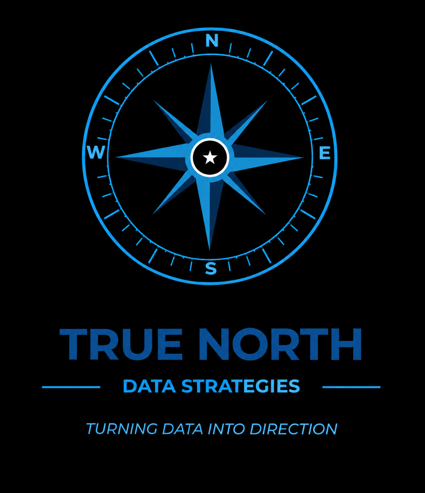

<h1 align="center">Jacob Johnston</h1>
<h3 align="center">Operator who builds. Petroleum operations first.</h3>

  

 

&nbsp;&nbsp;&nbsp;&nbsp;&nbsp;&nbsp;&nbsp;&nbsp;&nbsp;&nbsp;&nbsp;&nbsp;

 

## Table of Contents

- [Who I Am](#who-i-am)
- [Three Fronts](#three-fronts)
- [How I Build](#how-i-build)
- [Systems](#systems)
  - [Petroleum Operations](#petroleum-operations)
  - [Compliance](#compliance)
  - [Knowledge and Delivery](#knowledge-and-delivery)
  - [Public Repositories](#public-repositories)
- [Stack](#stack)
- [Contact](#contact)

## Who I Am

Founder of True North Data Strategies LLC (TNDS), a service-disabled veteran-owned fractional operations practice in Colorado Springs, Colorado. I embed with small and mid-sized operators, petroleum marketers and fuel haulers first, fix the operation, document the procedures, train the crew, cut the tool sprawl, and hand it back running.

Before TNDS: eight years at a regional petroleum carrier, finishing as Transportation Department Head with full DOT and FMCSA ownership. The first systems in this portfolio were built there, on the night shift, because nobody else was going to. Before that, 20 years in the U.S. Army, Airborne Infantry.

I am operations first and engineer second. Everything below exists because a dispatcher, a driver, a plant manager, or a bookkeeper had a problem that a spreadsheet and a script could remove.

## Three Fronts

| Brand | Role | Who it serves |
|---|---|---|
| **True North Data Strategies** | The consulting practice and contract entity. Operations assessments, department and full-operation embeds, procedure libraries, and the managed-operations retainer that follows. | Owners, executives, and operators in petroleum and other regulated field industries |
| **Pipeline Punks** | The build-in-public brand. Practical builds, walkthroughs, templates, a weekly newsletter for operators, a YouTube channel, and a learning track for operators who want to build their own tools. Synthetic data only, never client systems. | Operators, builders, students, and future clients |
| **True North FOB** | Forward Operating Base. The managed-operations layer where TNDS runs a client's environment after the embed: isolated client pods, declared systems of record, dashboards, documentation, change control, and a defined exit path. | Active clients and the TNDS operators supporting them |

Pipeline Punks shows what can be built. TNDS sells and delivers the business outcome. FOB houses the ongoing relationship.

## How I Build

| Principle | What it means in practice |
|---|---|
| Rent the engine, own the moat | Models, frameworks, and cloud services are replaceable. Operator knowledge and client trust are not. |
| Simplest tool that works | Google Sheets and Apps Script before a database. A database before a platform. |
| Template plus config | Every workbook is a template plus a config file. Client data arrives by CSV import and the workbook carries no client identity. New client is copy, configure, import. |
| Compliance by design | Audit logs, version stamps, and document control are built in on day one, not bolted on after the audit letter arrives. |
| Tools the client keeps | Menu-driven, no hidden timed triggers, fully documented, and still running the day I leave. |

## Systems

Names below are TNDS product names. Client deployments carry the client's own branding and configuration. Most of these repositories are private because they hold deployment detail; public repositories are listed at the end.

### Petroleum Operations

| Product | What it does | Built with | Status |
|---|---|---|---|
| **Rack Command** | Daily fuel pricing workbook generated from a config file: taxes by tax group, supplier terms keyed by supplier and terminal, freight, cardlock and retail landed cost with below-floor flags, rack history, and a change log. | Apps Script, Sheets, Python builder | Deployed |
| **Dispatch Command** | Dispatch system of record for bulk plant and transport operations that were running on printed sales orders and memory. Driver recap, dispatcher dashboard, and a miss-rate baseline the owner can read at a glance. | Apps Script, Sheets | In build |
| **IFTA Command** | Quarterly IFTA reporting workbook with a trip-permit register mode for carriers that run rental trucks out of state. Per-client deploy targets from one codebase. | Apps Script, Sheets | Deployed |
| **PetroStack** | Rack pricing feed rollup and petroleum market conditions reporting for fuel marketers, delivered as a client-facing brief. Multi-client by config. | Python, Word render | Deployed |
| **Rack Recon** | Nightly parse of multiple supplier price emails across four attachment formats into one sheet, ranked by terminal with freight and fuel surcharge applied. Replaced 1.5 hours of manual price entry six nights a week. | Python, Sheets | Proven in production |
| **BOL Command** | DTN Terminal exports pulled from an FTP drop into Drive, parsed, and loaded into Sheets. Ended hand-typing bill of lading numbers off printouts and caught missing BOLs before month-end close. | Apps Script, Drive | Proven in production |

### Compliance

| Product | What it does | Built with | Status |
|---|---|---|---|
| **Cardinal** | Single-tenant regulatory question-and-answer system for fuel haulers over a DOT, FMCSA, IFTA, and hazmat corpus. Grounded retrieval with a similarity floor so it refuses rather than guesses, hash-chained audit log, local embeddings. | Python, PostgreSQL, Ollama, Cloud Run, Next.js | In production, first design-partner seat open |
| **Compliance Command** | Asset, driver, and cargo tank compliance tracker: vapor and DOT test dates, expirations, red, yellow, and green status, plus CSV and read-only API importers for Fleetio, Verizon Connect, TankScan, BizSpeed, and Motive. Answers the 5 a.m. question: which units are clear to load. | Apps Script, Sheets | Deployed |
| **Driver Command** | Driver qualification file tracking against the federal requirements, with expiration flags and an open-items queue. | Apps Script, Sheets | Deployed |
| **CFR Academy** | Training courses built from the regulations themselves, for driver and office staff. | Next.js, PostgreSQL | Pilot live |

### Knowledge and Delivery

| Product | What it does | Built with | Status |
|---|---|---|---|
| **KnowledgeOps OS** | Twelve-domain folder and document skeleton deployed as a client's Google Shared Drive, with industry domain packs, an inbox doctrine so staff know exactly where to drop files, automated QA checks, and a deploy script. | Apps Script, Python, Google Drive | Two companies live |
| **SOP Forge** | Browser-based procedure builder the client's own staff can run. Produces a ten-section standard operating procedure, a four-quadrant process worksheet, and a branded Word document from one payload. | HTML, JavaScript, Python render | Deployed |
| **CourseForge** | Drops in a stack of documents and produces internal training courses and public documentation. One private core with isolated deployment overlays per client, so no client content ever ships to another. | Next.js, PostgreSQL, Clerk | Final build |
| **FOB Command Center** | The managed-operations layer behind True North FOB: client dashboards, module services, and a governed agent layer with declared authority, logging, and rollback. | TypeScript monorepo | In build |

### Public Repositories

| Repository | What it does | Built with |
|---|---|---|
| **parallel-agentstack** | Provider-agnostic coordination framework for running several AI agents (Claude, ChatGPT, Ollama, or any LLM) on the same project at the same time. Each agent owns a track and works inside declared file zones so two writers never collide. | PowerShell |
| **n8n** (fork) | Workflow automation platform, kept for reference and local modification. | TypeScript |
| **chrome-devtools-mcp** (fork) | Chrome DevTools for coding agents, kept for reference and local modification. | TypeScript |

## Stack

| Layer | Tools |
|---|---|
| Workspace automation | Google Apps Script, Google Sheets, Drive, Gmail |
| Languages | Python, TypeScript, Node.js, PowerShell |
| Web | Next.js, Vercel, Cloudflare |
| Data | PostgreSQL (Neon and self-hosted), Qdrant vector search |
| AI | Local model inference with Ollama for private and offline work, hosted models where the job allows |
| Runtime | Google Cloud Run, Railway, Docker |

## Contact

Jacob Johnston
True North Data Strategies LLC, SDVOSB
Colorado Springs, Colorado
jacob@truenorthstrategyops.com
truenorthstrategyops.com
pipelinepunks.com
truenorthfob.org
